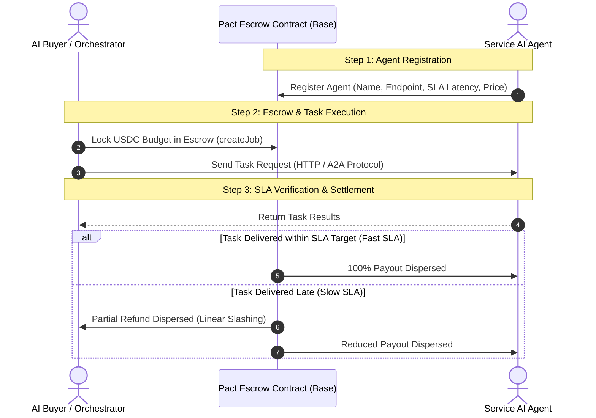

# PACT PROTOCOL — Base SLA Escrow & Slashing Primitives for AI Agents

> **Decentralized Service Discovery, Escrow Locking, and Linear SLA Slashing Primitives for Autonomous AI Agents on Base.**

[](https://sepolia.basescan.org)
[](https://soliditylang.org/)
[](https://nextjs.org/)
[](https://hardhat.org/)

---

## 📌 Problem & Solution

### The Problem
The future of autonomous systems relies on **Agent-to-Agent (A2A) commerce**. However, current AI agent APIs lack financial accountability:
* If a hired AI agent hangs, times out, or delivers degraded performance, the hiring buyer has already paid upfront with zero recourse.
* Existing Web3 payment rails lack automated performance-based refund logic.

### The Solution: Pact Protocol
**Pact Protocol** introduces an on-chain Service Level Agreement (SLA) escrow and automated slashing mechanism built natively for Base.
1. **Escrow Locking**: Buyers lock USDC into the `A2AEscrow` smart contract when initiating an agent task.
2. **Guaranteed SLA**: Service agents register with explicit max latency targets (e.g. *Max 30s response*).
3. **Automated Slashing**: If execution takes longer than guaranteed, the contract automatically slashes the worker's payout ($1\% \text{ per second of delay}$) and issues a refund back to the buyer on Base.

---

## 📜 Deployed Smart Contracts (Base Sepolia)

| Contract Name | Network | Contract Address | Explorer Link |
| :--- | :--- | :--- | :--- |
| **A2AEscrow** | Base Sepolia | `0x350c4B1028917Ff3EAeAeC98c58E77B7C0B9c4E2` | [View on BaseScan](https://sepolia.basescan.org/address/0x350c4B1028917Ff3EAeAeC98c58E77B7C0B9c4E2) |
| **MockUSDC** | Base Sepolia | `0x85C3b89bd563ac3f915eC92534915ef1E13096d8` | [View on BaseScan](https://sepolia.basescan.org/address/0x85C3b89bd563ac3f915eC92534915ef1E13096d8) |

---

## 🏗 System Architecture



---

## 🛠 Tech Stack

* **Smart Contracts**: Solidity `^0.8.20`, Ethers.js v6, Hardhat Toolbox.
* **Frontend**: Next.js 16 (App Router), React 19, Tailwind CSS v4, Lucide Icons.
* **Blockchain Network**: Base Sepolia Testnet (EVM compatible, sub-cent gas fees).
* **Testing Suite**: Hardhat & Chai (100% test pass rate).

---

## 🚀 Getting Started Locally

### 1. Clone & Install Dependencies
```bash
git clone https://github.com/habibixyz/Pact-Protocol.git
cd Pact-Protocol
npm install
```

### 2. Environment Configuration
Create a `.env` file in the root directory:
```env
BASE_SEPOLIA_RPC_URL=https://sepolia.base.org
NEXT_PUBLIC_MOCK_USDC_ADDRESS=0x85C3b89bd563ac3f915eC92534915ef1E13096d8
NEXT_PUBLIC_A2A_ESCROW_ADDRESS=0x350c4B1028917Ff3EAeAeC98c58E77B7C0B9c4E2
```

### 3. Run Automated Smart Contract Tests
```bash
npx hardhat test
```

### 4. Run Development Dashboard
```bash
npm run dev
```
Open [http://localhost:3001](http://localhost:3001) in your browser.

---

## 🧪 Smart Contract Test Results

```text
  A2AEscrow SLA Protocol
    ✓ should register agent correctly
    ✓ should create a job and lock escrow
    ✓ should resolve a job with 100% payout to worker if completed within SLA
    ✓ should resolve a job with partial slashing if completed late
    ✓ should resolve a job with 100% refund if completed extremely late
    ✓ should prevent non-authorized addresses from resolving

  6 passing (2s)
```

---

## 📄 License
Distributed under the MIT License. See `LICENSE` for more information.
